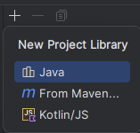
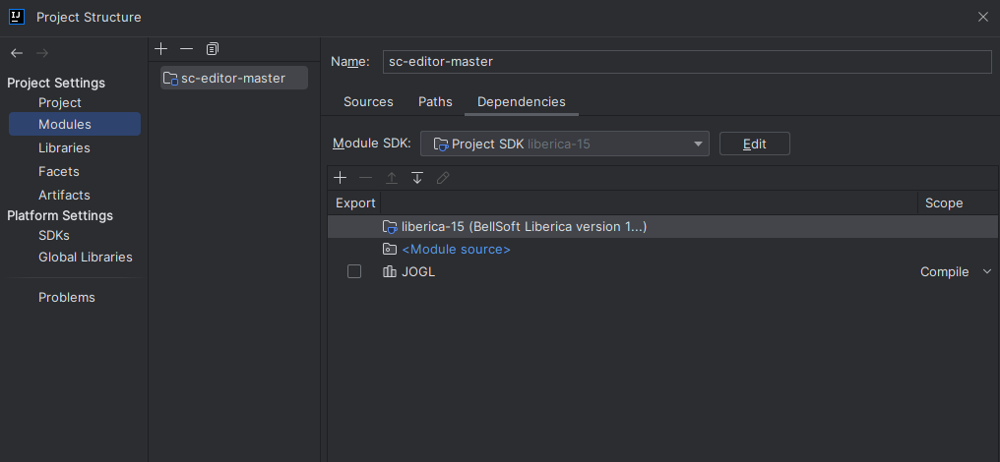
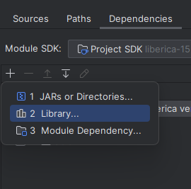

# SC Editor
Java 15+ required.

[Technical Requirements (ru)](./docs/technical_requirements.md)

## Build
First of all, download the following libraries:

1. [JOGL](https://jogamp.org/)
   1. Native libraries for your OS
      - gluegen-rt-natives-[...].jar
      - jogl-all-natives-[...].jar
   2. Default libraries
      - gluegen-rt.jar
      - jogl-all.jar 
2. [FlatLaf](https://search.maven.org/artifact/com.formdev/flatlaf/)

Then, add the libraries and resources to project modules to include it into the build.

In JetBrains IDEA:
1. Project Structure -> Global/Project Libraries.
2. Click Java and select downloaded jar files. <br/> 
3. Go into Project Structure -> Modules, select your module. <br/> 
4. Add library in module dependencies and apply. <br/> 
5. Go into Sources tab and mark resources folder as Resources to include it into the build. 

Done! 

# Running
1. Download jar from [releases](https://github.com/danila-schelkov/sc-editor/releases) for your OS or build it yourself.
2. Run with command line:
   ```bash
   java -jar sc-editor.jar
   ```
P.s:
According to [the question](https://stackoverflow.com/questions/66722833/executable-jar-with-dependencies-and-dll-dependency-using-maven),
just add `--illegal-access=permit` to the VM-Options to run the editor with Java 16+:
```bash
java --illegal-access=permit -jar sc-editor.jar
```
